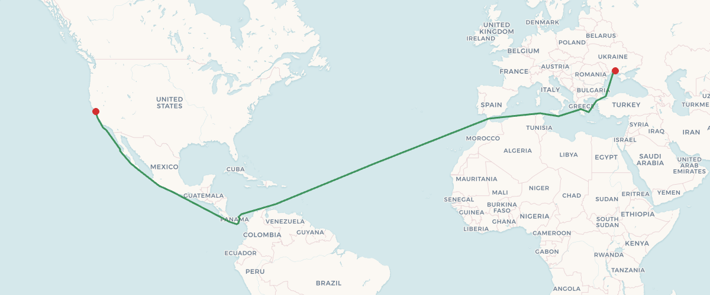
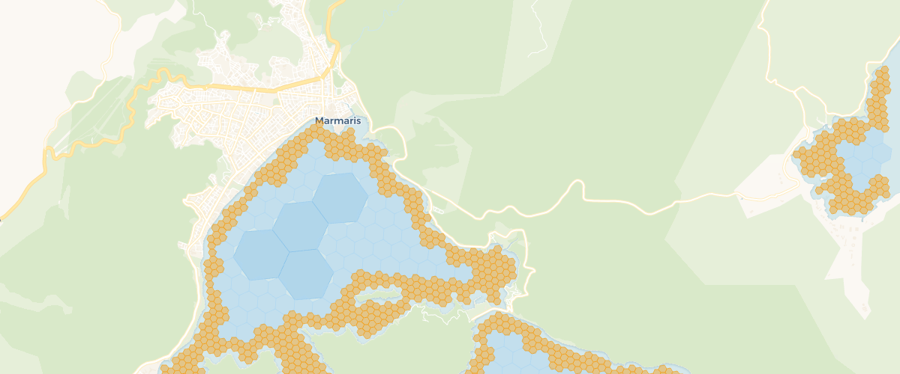

# auto-sea-way

Open source maritime auto-routing. Generates a global water-surface routing graph from OpenStreetMap land polygon data using H3 hexagonal grid indexing. Pure Rust.



*San Francisco to Mykolaiv (9,768 nm) — computed route through the Panama Canal, across the Atlantic, through the Mediterranean and into the Black Sea. More benchmark routes in [bench-routes.geojson](benchmarks/bench-routes.geojson).*

## Why auto-sea-way?

If you're building a maritime application — fleet tracking, voyage planning, logistics
optimization — you need a way to compute realistic sea routes between coordinates.
The alternatives are:

- **Commercial SaaS APIs** — subscription pricing, closed-source,
  no self-hosting option, vendor lock-in
- **Open-source libraries** ([eurostat/searoute](https://github.com/eurostat/searoute),
  [searoute-py](https://github.com/genthalili/searoute-py),
  [scgraph](https://github.com/connor-makowski/scgraph)) —
  route on pre-curated shipping lane networks (~4K edges), no coastline detail,
  can't distinguish a harbor entrance from open ocean

auto-sea-way takes a different approach: it **generates** a high-resolution routing graph
algorithmically from OpenStreetMap land polygons using H3 hexagonal indexing. The result is
~40M navigable cells with adaptive resolution — coarse in open ocean (fast), fine near
coastlines and through narrow passages like Suez and Panama (accurate).

Ship it as a single binary + graph file. Self-hosted, no third-party API keys, no rate limits.

## Quick Start

```bash
# Start the routing server (graph file included in image)
docker run -e ASW_API_KEY=changeme -p 3000:3000 ghcr.io/auto-sea-way/asw:0.6.0-full
```

Wait for the `/ready` endpoint to return 200 (~60-90s while the graph loads), then query a route:

```bash
curl -H 'X-Api-Key: changeme' \
  'http://localhost:3000/route?from=36.85,28.27&to=36.39,25.46'
```

Returns a GeoJSON LineString. See [API Endpoints](#api-endpoints) for all available routes and [Deployment Guide](docs/deployment.md) for Docker Compose, Kubernetes, and bare-metal examples.



*Adaptive H3 hexagonal grid at Marmaris Bay — coarse cells in open water, fine resolution along the coastline.*

## How It Works

1. **Read** OSM land polygons shapefile
2. **Generate** H3 hexagonal grid over ocean areas (adaptive cascade: res-3 deep ocean through res-9 shoreline, up to res-13 in passage corridors)
3. **Classify** cells as navigable using hierarchical elimination and polygon intersection
4. **Build** routing graph edges between adjacent navigable cells (same-resolution + cross-resolution)
5. **Refine** passage corridors (Suez, Panama, Bosphorus, etc.) to higher resolutions for accurate navigation
6. **Serialize** graph to compact binary format (bitcode + zstd-19, sorted H3 indices for O(log n) spatial lookup)

## Comparison with Alternatives

| | auto-sea-way | [scgraph](https://github.com/connor-makowski/scgraph) | [eurostat/searoute](https://github.com/eurostat/searoute) | [searoute-py](https://github.com/genthalili/searoute-py) | Commercial SaaS APIs |
|---|---|---|---|---|---|
| **Routing graph** | Generated from OSM data (~40M cells) | Pre-curated shipping lane network (marnet) | Static hand-drawn (~4K edges) | Static hand-drawn (~4K edges) | Proprietary |
| **Coastline detail** | Adaptive res-3→res-13 | None — routes along lane waypoints | Fixed low resolution | Fixed low resolution | Varies |
| **Narrow passages** | Suez, Panama, Bosphorus, etc. | Only if in curated dataset | Approximate | Approximate | Usually yes |
| **Arbitrary coordinates** | Yes | Snaps to nearest lane node (KD-tree) | Ports + coords | Ports + coords | Varies |
| **Self-hosted** | Yes — single binary | Yes — Python library | Yes — Java library | Yes — Python library | No |
| **API server included** | Yes (HTTP/JSON) | No | No | No | Yes |
| **Multi-modal** | Maritime only | Maritime, road, rail, custom | Maritime only | Maritime only | Varies |
| **Language** | Rust | Python (optional C++ extension) | Java | Python | — |
| **License** | MIT / Apache 2.0 | MIT | EUPL | MIT | Proprietary |
| **Status** | Active | Active | Inactive (last commit 2023) | Maintained | — |

## Routing Benchmarks

20 routes, 50 iterations each. Graph v3 format (bitcode + H3 binary search). Graphs built with v2 must be rebuilt — v2 files are rejected at load time.

Routes start and end at the exact requested coordinates; distances count only the water segments (overland connectors for pins placed on land are excluded).

### Sailing Routes

| Route | Distance | P50 | P95 | Hops |
|-------|----------|-----|-----|------|
| English Channel | 22.1nm | 0.3ms | 0.3ms | 33>4 |
| Aegean Hop | 25.3nm | 0.8ms | 0.8ms | 54>6 |
| Strait of Gibraltar | 29.4nm | 0.8ms | 0.8ms | 63>5 |
| Baltic Crossing | 42.0nm | 1.5ms | 1.5ms | 53>5 |
| Balearic Sea | 127.6nm | 2.2ms | 2.2ms | 114>7 |
| Florida Strait | 89.0nm | 0.5ms | 0.5ms | 22>4 |
| Malacca Route | 534.3nm | 39.1ms | 39.3ms | 497>21 |
| Tasman Sea | 1265.1nm | 57.3ms | 59.9ms | 408>17 |
| South Atlantic | 3272.3nm | 30.8ms | 31.9ms | 392>8 |
| North Atlantic | 3040.5nm | 869ms | 1.07s | 682>18 |

### Passage Transits

| Route | Distance | P50 | P95 | Hops |
|-------|----------|-----|-----|------|
| Suez Canal | 141.2nm | 13.1ms | 13.3ms | 1155>24 |
| Panama Canal | 53.5nm | 76.0ms | 79.2ms | 1029>54 |
| Kiel Canal | 84.2nm | 39.0ms | 41.3ms | 1976>57 |
| Corinth Canal | 6.5nm | 1.5ms | 1.6ms | 364>8 |
| Bosphorus | 32.7nm | 1.8ms | 1.9ms | 163>11 |
| Dardanelles | 45.1nm | 1.4ms | 1.5ms | 116>6 |
| Malacca Strait | 28.9nm | 1.4ms | 1.4ms | 89>6 |
| Singapore Strait | 27.2nm | 1.0ms | 1.1ms | 46>5 |
| Messina Strait | 16.1nm | 0.6ms | 0.7ms | 68>6 |
| Dover Strait | 18.4nm | 0.4ms | 0.5ms | 17>5 |

## API Endpoints

| Endpoint | Auth | Purpose |
|----------|------|---------|
| `GET /route?from=lat,lon&to=lat,lon` | Required | Compute maritime route, returns GeoJSON LineString |
| `GET /info` | Required | Graph metadata: node/edge counts, version |
| `GET /health` | None | Liveness probe (always 200) |
| `GET /ready` | None | Readiness probe (503 during graph load, 200 when ready) |

Protected endpoints require an `X-Api-Key` header matching the configured `ASW_API_KEY`. Requests with a missing or invalid key receive `401 Unauthorized`.

**`/route` parameters:**

- `from`, `to` — `lat,lon` coordinates
- `shore_buffer` (optional, nautical miles, `0`–`5.0`, default `0`) — soft clearance: the router strongly prefers water at least this far from the coastline, but can still enter harbors/coves when there is no alternative; not a hard guarantee. The response echoes the requested value as `shore_buffer_nm`

**`/route` response:** `distance_nm` counts only water segments. When a requested point sits on land, the geometry still starts/ends exactly there, and the overland connector segments are listed in `land_legs` (segment indices into `geometry.coordinates`) so clients can render them differently — they contribute nothing to `distance_nm`. Land detection is a coastline-crossing test, not point-in-polygon: a segment that lies entirely inland on one landmass, never touching a coastline, is not detected. `land_legs` covers pins near the shore, not arbitrary points deep inland.

## Packages

### Docker Images

Hosted on [GitHub Container Registry](https://ghcr.io/auto-sea-way/asw):

| Image | Tag | Description |
|-------|-----|-------------|
| `ghcr.io/auto-sea-way/asw` | `latest`, `0.6.0` | Slim image — bring your own graph file or auto-download via `ASW_GRAPH_URL` |
| `ghcr.io/auto-sea-way/asw` | `latest-full`, `0.6.0-full` | Full image — graph file included (~740 MB) |

Both images are available for `linux/amd64` and `linux/arm64`.

```bash
# Full image — zero config, graph included (~740 MB)
docker run -e ASW_API_KEY=your-secret -p 3000:3000 ghcr.io/auto-sea-way/asw:0.6.0-full

# Slim image — auto-download graph on first start (cached in volume)
docker run -e ASW_API_KEY=your-secret \
  -e ASW_GRAPH_URL=https://github.com/auto-sea-way/asw/releases/download/v0.6.0/asw.graph \
  -v asw-data:/data -p 3000:3000 ghcr.io/auto-sea-way/asw:0.6.0

# Slim image — mounted graph file
docker run -e ASW_API_KEY=your-secret \
  -v /path/to/asw.graph:/data/asw.graph -p 3000:3000 ghcr.io/auto-sea-way/asw:0.6.0
```

The full planet graph needs ~4.1 GiB RSS right after load (measured, Linux), growing with query coverage as A* buffer pages are touched — 4.3 GiB measured after a globally diverse route mix, ~4.8 GiB hard ceiling. Plan for ~5 GiB total. A **4 GB instance with a generous swap file** still works but pages under load; an **8 GB instance** is recommended. Graph loading takes ~60-90s; wait for `/ready` to return 200 before sending route queries.

See [Deployment Guide](docs/deployment.md) for Docker Compose, Kubernetes, and bare-metal examples.

### Pre-built Binaries

Download from [GitHub Releases](https://github.com/auto-sea-way/asw/releases):

| Platform | Binary |
|----------|--------|
| Linux x86_64 | `asw-linux-amd64` |
| Linux ARM64 | `asw-linux-arm64` |
| macOS x86_64 | `asw-darwin-amd64` |
| macOS ARM64 (Apple Silicon) | `asw-darwin-arm64` |

Each release also includes the pre-built `asw.graph` file and `SHA256SUMS` for verification.

## Full Planet Build

Built on Hetzner ccx53 (32 dedicated vCPU, 128 GB RAM) in ~5 hours:

| Metric | Value |
|--------|-------|
| Nodes | 39,412,823 |
| Edges | 299,517,836 |
| Graph file size | 717 MB |
| Connectivity | 100% (single connected component after build-time pruning) |
| Server memory (RSS) | ~4.1 GiB after load, 4.3 GiB measured under global traffic (~4.8 GiB ceiling) |
| Server memory (total) | plan for ~5 GiB (needs swap below 8 GB) |
| Minimum instance | 4 GB RAM + swap (pages under load), recommended 8 GB |

```bash
asw cloud build --output export/asw.graph
```

## CLI Reference

```bash
# Local build
asw build --shp land-polygons-split-4326 --bbox marmaris --output export/marmaris.graph

# Cloud build (full pipeline)
asw cloud build --bbox marmaris --output export/marmaris.graph --keep-server

# Server management
asw cloud provision
asw cloud status
asw cloud teardown

# Serve routing API (requires ASW_API_KEY in .env or --api-key)
asw serve --graph export/asw.graph --host 0.0.0.0 --port 3000

# Export as GeoJSON for visualization
asw geojson --graph export/asw.graph --bbox marmaris --coastline --output export/asw.geojson

# Benchmark routing performance (20 fixed routes, 50 iterations each)
asw bench --graph export/asw.graph --output export/bench.json
asw bench --compare export/bench.json          # compare against a saved baseline
asw bench --shore-buffer 1.0                   # benchmark with the shore-clearance penalty applied
```

Bbox supports presets (`dev`, `dev-small`, `marmaris`) or `min_lon,min_lat,max_lon,max_lat`.

## Architecture

Rust workspace with 5 crates:

```
crates/
├── asw-core      # Graph data structures, H3 utilities, routing (A*)
├── asw-build     # Graph builder: shapefiles → H3 grid → edges
├── asw-serve     # HTTP API server (axum)
├── asw-cloud     # Hetzner provisioning + SSH/SCP + remote build pipeline
└── asw-cli       # CLI entry point
```

## Building from Source

Requires Rust (see `rust-toolchain.toml` for the pinned version):

```bash
cargo build --release -p asw-cli
```

## Environment Variables

| Variable | Default | Description |
|----------|---------|-------------|
| `ASW_PORT` | `3000` | Server listen port |
| `ASW_HOST` | `0.0.0.0` | Bind address |
| `ASW_GRAPH` | `export/asw.graph` | Path to graph file |
| `ASW_GRAPH_URL` | — | URL to download graph if file is missing |
| `ASW_API_KEY` | — | **Required.** API key for authenticating `/route` and `/info` requests |
| `HETZNER_TOKEN` | — | Hetzner API token for cloud builds |

## Known Limitations

- **No depth data.** Routing treats all water as navigable — there is no bathymetry or draft-clearance check. This is generally fine for small craft like sailing boats but may route larger vessels through shallow areas. The `shore_buffer` parameter partially mitigates this by keeping routes off headlands and uncharted near-shore hazards, but it is not a substitute for nautical charts.

## Data Sources

Geographic data is derived from [OpenStreetMap](https://www.openstreetmap.org/), © OpenStreetMap contributors, available under the [Open Database License (ODbL) v1.0](https://opendatacommons.org/licenses/odbl/1-0/).

| Dataset | Size | License |
|---------|------|---------|
| [OSM land polygons](https://osmdata.openstreetmap.de/data/land-polygons.html) | ~900MB | ODbL |
| [Geofabrik regional extracts](https://download.geofabrik.de/) (canal water polygons) | varies | ODbL |

## License

Licensed under either of

- Apache License, Version 2.0 ([LICENSE-APACHE](LICENSE-APACHE) or http://www.apache.org/licenses/LICENSE-2.0)
- MIT license ([LICENSE-MIT](LICENSE-MIT) or http://opensource.org/licenses/MIT)

at your option.

## Changelog

See [CHANGELOG.md](CHANGELOG.md) for a detailed list of changes in each release.
