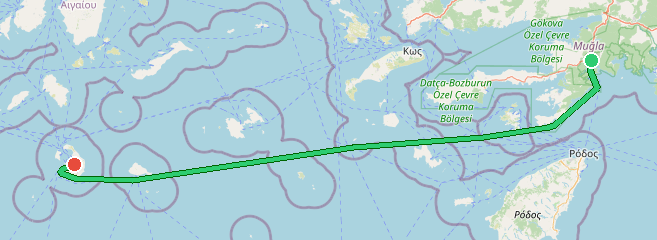

# auto-sea-way

Open source maritime auto-routing. Generates a global water-surface routing graph from OpenStreetMap land polygon data using H3 hexagonal grid indexing. Pure Rust.



*Marmaris to Santorini (160 nm) — computed route through the Aegean. More benchmark routes in [bench-routes.geojson](benchmarks/bench-routes.geojson) (GeoJSON map preview works in desktop web browser).*

## Quick Start

```bash
# Build locally (downloads land polygons automatically, or pass --shp)
cargo build --release -p asw-cli
./target/release/asw build --bbox marmaris --output export/marmaris.graph

# Cloud build (Hetzner — provision, build, download, teardown)
asw cloud build --bbox marmaris --output export/marmaris.graph --keep-server
asw cloud teardown
```

`HETZNER_TOKEN` is read from `.env` automatically.

## Docker

```bash
# Full image — zero config, graph included (~870 MB)
docker run -e ASW_API_KEY=your-secret -p 3000:3000 ghcr.io/auto-sea-way/asw:0.1.0-full

# Slim image — auto-download graph on first start (cached in volume)
docker run -e ASW_API_KEY=your-secret \
  -e ASW_GRAPH_URL=https://github.com/auto-sea-way/asw/releases/download/v0.1.0/asw.graph \
  -v asw-data:/data -p 3000:3000 ghcr.io/auto-sea-way/asw:0.1.0

# Slim image — mounted graph file
docker run -e ASW_API_KEY=your-secret \
  -v /path/to/asw.graph:/data/asw.graph -p 3000:3000 ghcr.io/auto-sea-way/asw:0.1.0
```

The full planet graph needs ~4.2 GiB total memory (3.5 GiB RSS + ~750 MiB swap). A **4 GB instance with swap** works; an **8 GB instance** runs comfortably without swap. Graph loading takes ~60-90s; wait for `/ready` to return 200 before sending route queries.

```bash
# Query a route (Marmaris → Santorini)
curl -H 'X-Api-Key: your-secret' 'http://localhost:3000/route?from=36.85,28.27&to=36.39,25.46'

# Check server readiness (no auth required)
curl http://localhost:3000/ready

# Server info (node/edge counts)
curl -H 'X-Api-Key: your-secret' http://localhost:3000/info
```

See [Deployment Guide](docs/deployment.md) for Docker Compose, Kubernetes, and bare-metal examples.

## Packages

### Pre-built Binaries

Download from [GitHub Releases](https://github.com/auto-sea-way/asw/releases):

| Platform | Binary |
|----------|--------|
| Linux x86_64 | `asw-linux-amd64` |
| Linux ARM64 | `asw-linux-arm64` |
| macOS x86_64 | `asw-darwin-amd64` |
| macOS ARM64 (Apple Silicon) | `asw-darwin-arm64` |

Each release also includes the pre-built `asw.graph` file and `SHA256SUMS` for verification.

### Docker Images

Hosted on [GitHub Container Registry](https://ghcr.io/auto-sea-way/asw):

| Image | Tag | Description |
|-------|-----|-------------|
| `ghcr.io/auto-sea-way/asw` | `latest`, `0.1.0` | Slim image — bring your own graph file or auto-download via `ASW_GRAPH_URL` |
| `ghcr.io/auto-sea-way/asw` | `latest-full`, `0.1.0-full` | Full image — graph file included (~870 MB) |

Both images are available for `linux/amd64` and `linux/arm64`.

### Building from Source

Requires Rust (see `rust-toolchain.toml` for the pinned version):

```bash
cargo build --release -p asw-cli
```

## How It Works

1. **Read** OSM land polygons shapefile
2. **Generate** H3 hexagonal grid over ocean areas (adaptive cascade: res-3 deep ocean through res-10 shoreline, up to res-13 in passage corridors)
3. **Classify** cells as navigable using hierarchical elimination and polygon intersection
4. **Build** routing graph edges between adjacent navigable cells (same-resolution + cross-resolution)
5. **Refine** passage corridors (Suez, Panama, Bosphorus, etc.) to higher resolutions for accurate navigation
6. **Serialize** graph to compact binary format (bitcode + zstd-19, sorted H3 indices for O(log n) spatial lookup)

## CLI Reference

```bash
# Local build
asw build --shp land-polygons-split-4326 --bbox marmaris --output export/marmaris.graph

# Cloud build (full pipeline)
asw cloud build --bbox marmaris --output export/marmaris.graph --keep-server

# Server management
asw cloud provision
asw cloud status
asw cloud teardown

# Serve routing API (requires ASW_API_KEY in .env or --api-key)
asw serve --graph export/asw.graph --host 0.0.0.0 --port 3000

# Export as GeoJSON for visualization
asw geojson --graph export/asw.graph --bbox marmaris --coastline --output export/asw.geojson
```

Bbox supports presets (`dev`, `dev-small`, `marmaris`) or `min_lon,min_lat,max_lon,max_lat`.

## Architecture

Rust workspace with 5 crates:

```
crates/
├── asw-core      # Graph data structures, H3 utilities, routing (A*)
├── asw-build     # Graph builder: shapefiles → H3 grid → edges
├── asw-serve     # HTTP API server (axum)
├── asw-cloud     # Hetzner provisioning + SSH/SCP + remote build pipeline
└── asw-cli       # CLI entry point
```

## Full Planet Build

Built on Hetzner ccx53 (32 dedicated AMD CPUs, 128 GB RAM) in ~4.5 hours:

| Metric | Value |
|--------|-------|
| Nodes | 40,398,071 |
| Edges | 305,035,106 |
| Graph file size | 712 MB |
| Connectivity | 96.9% (largest component: 39.1M nodes) |
| Server memory (RSS) | ~3.5 GiB |
| Server memory (total) | ~4.2 GiB (needs swap on 4 GB nodes) |
| Minimum instance | 4 GB RAM + swap, recommended 8 GB |

```bash
asw cloud build --output export/asw.graph
```

## Routing Benchmarks

20 routes, 10 iterations each. Graph v2 format (bitcode + H3 binary search).

### Sailing Routes

| Route | Distance | P50 | P95 | Hops |
|-------|----------|-----|-----|------|
| English Channel | 22.1nm | 0.4ms | 0.4ms | 33>3 |
| Aegean Hop | 25.1nm | 1.0ms | 2.1ms | 51>5 |
| Strait of Gibraltar | 29.0nm | 1.1ms | 1.7ms | 62>3 |
| Baltic Crossing | 42.0nm | 2.1ms | 2.4ms | 54>5 |
| Balearic Sea | 127.3nm | 3.0ms | 3.3ms | 111>6 |
| Florida Strait | 88.1nm | 0.5ms | 0.7ms | 14>2 |
| Malacca Route | 537.3nm | 45.9ms | 49.4ms | 477>20 |
| Tasman Sea | 1265.1nm | 80.2ms | 147.8ms | 408>16 |
| South Atlantic | 3272.5nm | 59.9ms | 208.3ms | 354>6 |
| North Atlantic | 3040.5nm | 1.16s | 1.64s | 682>17 |

### Passage Transits

| Route | Distance | P50 | P95 | Hops |
|-------|----------|-----|-----|------|
| Suez Canal | 141.0nm | 20.0ms | 22.0ms | 1126>22 |
| Corinth Canal | 7.0nm | 1.8ms | 2.3ms | 428>10 |
| Bosphorus | 31.3nm | 2.4ms | 3.1ms | 162>11 |
| Dardanelles | 40.4nm | 2.9ms | 3.6ms | 137>6 |
| Malacca Strait | 30.0nm | 2.1ms | 2.5ms | 67>5 |
| Singapore Strait | 40.8nm | 0.5ms | 0.6ms | 26>2 |
| Messina Strait | 15.6nm | 0.7ms | 1.0ms | 65>5 |
| Dover Strait | 19.0nm | 0.1ms | 0.9ms | 4>2 |

## API Endpoints

| Endpoint | Auth | Purpose |
|----------|------|---------|
| `GET /route?from=lat,lon&to=lat,lon` | Required | Compute maritime route, returns GeoJSON LineString |
| `GET /info` | Required | Graph metadata: node/edge counts, version |
| `GET /health` | None | Liveness probe (always 200) |
| `GET /ready` | None | Readiness probe (503 during graph load, 200 when ready) |

Protected endpoints require an `X-Api-Key` header matching the configured `ASW_API_KEY`. Requests with a missing or invalid key receive `401 Unauthorized`.

## Environment Variables

| Variable | Default | Description |
|----------|---------|-------------|
| `ASW_PORT` | `3000` | Server listen port |
| `ASW_HOST` | `0.0.0.0` | Bind address |
| `ASW_GRAPH` | `export/asw.graph` | Path to graph file |
| `ASW_GRAPH_URL` | — | URL to download graph if file is missing |
| `ASW_API_KEY` | — | **Required.** API key for authenticating `/route` and `/info` requests |
| `HETZNER_TOKEN` | — | Hetzner API token for cloud builds |

## Changelog

See [CHANGELOG.md](CHANGELOG.md) for a detailed list of changes in each release.

## Known Limitations

- **No depth data.** Routing treats all water as navigable — there is no bathymetry or draft-clearance check. This is generally fine for small craft like sailing boats but may route larger vessels through shallow areas.
- **Panama Canal routing.** The Panama Canal passage is not correctly connected, causing routes to go around South America instead. Fix planned for a future release.
- **Kiel Canal routing.** The Kiel Canal passage is not correctly connected, causing routes to go around Denmark instead. Fix planned for a future release.

## Data Sources

| Dataset | Size | License |
|---------|------|---------|
| [OSM land polygons](https://osmdata.openstreetmap.de/data/land-polygons.html) | ~900MB | ODbL |

## License

Licensed under either of

- Apache License, Version 2.0 ([LICENSE-APACHE](LICENSE-APACHE) or http://www.apache.org/licenses/LICENSE-2.0)
- MIT license ([LICENSE-MIT](LICENSE-MIT) or http://opensource.org/licenses/MIT)

at your option.
