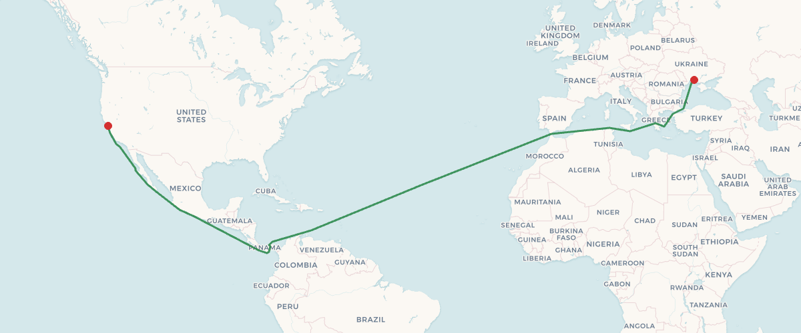
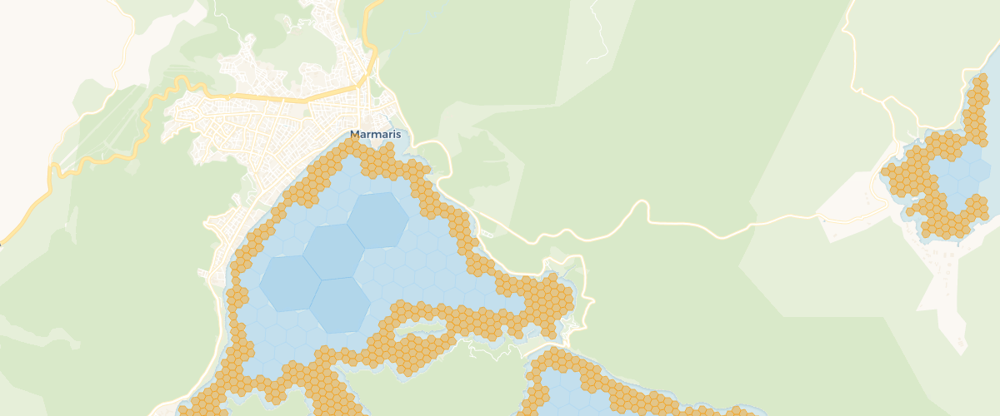

# auto-sea-way

Open source sea routing between any two coordinates on the planet. auto-sea-way builds a global routing graph of the water surface from OpenStreetMap coastlines, indexes it with H3 hexagons, and serves routes over a small HTTP API. Written in Rust.



*San Francisco to Mykolaiv (9,768 nm): the computed route goes through the Panama Canal, across the Atlantic, through the Mediterranean and into the Black Sea. More benchmark routes in [bench-routes.geojson](benchmarks/bench-routes.geojson).*

## Why auto-sea-way?

A maritime application such as fleet tracking, voyage planning or logistics needs realistic sea routes between coordinates: around headlands, through straits and canals, into harbours.

The existing options are limited in different ways:

- Commercial routing APIs are closed, priced per request, and cannot be hosted by you.
- The open source libraries ([eurostat/searoute](https://github.com/eurostat/searoute),
  [searoute-py](https://github.com/genthalili/searoute-py),
  [scgraph](https://github.com/connor-makowski/scgraph)) route along a hand-drawn network
  of about 4,000 shipping lanes. They have no coastline detail, so they cannot tell a
  harbour entrance from open ocean.

auto-sea-way generates its graph instead of drawing it. About 40 million navigable cells are derived from OpenStreetMap land polygons, coarse in the open ocean and fine along coastlines and inside narrow passages such as Suez and Panama. Routes start and end at the exact coordinates you ask for, and a route that has to touch land (a pin on a quay, a headland clipped by smoothing) reports which segments do.

You run it yourself: one binary and one graph file. Routing happens on your own server, so requests cost nothing and the coordinates stay with you.

## Quick Start

```bash
# Start the routing server (graph file included in image)
docker run -e ASW_API_KEY=changeme -p 3000:3000 ghcr.io/auto-sea-way/asw:0.9.0-full
```

Wait for the `/ready` endpoint to return 200 (a few seconds while the graph file is mapped and read in), then query a route:

```bash
curl -H 'X-Api-Key: changeme' \
  'http://localhost:3000/route?from=36.85,28.27&to=36.39,25.46'
```

Returns a GeoJSON LineString. See [API Endpoints](#api-endpoints) for all available routes and [Deployment Guide](docs/deployment.md) for Docker Compose, Kubernetes, and bare-metal examples.



*Adaptive H3 hexagonal grid at Marmaris Bay — coarse cells in open water, fine resolution along the coastline.*

## How It Works

1. **Read** OSM land polygons shapefile
2. **Generate** H3 hexagonal grid over ocean areas (adaptive cascade: res-3 deep ocean through res-10 shoreline, up to res-13 in passage corridors)
3. **Classify** cells as navigable using hierarchical elimination and polygon intersection
4. **Build** routing graph edges between adjacent navigable cells (same-resolution + cross-resolution)
5. **Refine** passage corridors (Suez, Panama, Bosphorus, etc.) to higher resolutions for accurate navigation
6. **Summarise** the graph as a coarse graph: one node per connected piece of water inside each res-3 region (about 41k nodes). A long route first finds its way on this coarse graph, and the fine search then stays inside a corridor around that path
7. **Serialize** graph to a flat memory-mapped binary file (format v5: sorted H3 ids, varint edge targets, per-node shore distance, delta-coded coastline runs with a 0.1° grid index, the coarse graph; no stored weights, no compression)

## Comparison with Alternatives

| | auto-sea-way | [scgraph](https://github.com/connor-makowski/scgraph) | [eurostat/searoute](https://github.com/eurostat/searoute) | [searoute-py](https://github.com/genthalili/searoute-py) | Commercial SaaS APIs |
|---|---|---|---|---|---|
| **Routing graph** | Generated from OSM data (~40M cells) | Pre-curated shipping lane network (marnet) | Static hand-drawn (~4K edges) | Static hand-drawn (~4K edges) | Proprietary |
| **Coastline detail** | Adaptive res-3→res-13 | None — routes along lane waypoints | Fixed low resolution | Fixed low resolution | Varies |
| **Narrow passages** | Suez, Panama, Bosphorus, etc. | Only if in curated dataset | Approximate | Approximate | Usually yes |
| **Arbitrary coordinates** | Yes | Snaps to nearest lane node (KD-tree) | Ports + coords | Ports + coords | Varies |
| **Self-hosted** | Yes — single binary | Yes — Python library | Yes — Java library | Yes — Python library | No |
| **API server included** | Yes (HTTP/JSON) | No | No | No | Yes |
| **Multi-modal** | Maritime only | Maritime, road, rail, custom | Maritime only | Maritime only | Varies |
| **Language** | Rust | Python (optional C++ extension) | Java | Python | — |
| **License** | MIT / Apache 2.0 | MIT | EUPL | MIT | Proprietary |
| **Status** | Active | Active | Inactive (last commit 2023) | Maintained | — |

## Routing Benchmarks

23 routes, 50 iterations each, on the planet graph (format v5, memory-mapped). Graphs in an older format must be rebuilt: older files are rejected at load time.

Routes start and end at the exact requested coordinates; distances count only the water segments (overland connectors for pins placed on land are excluded). Routes longer than 500 nm first find their way on the coarse graph and then search only a corridor around it; the three ocean crossings went from 0.7–4.5 s to 0.4–1.2 s with it.

### Sailing Routes

| Route | Distance | P50 | P95 | Hops |
|-------|----------|-----|-----|------|
| English Channel | 22.1nm | 205us | 217us | 34>4 |
| Aegean Hop | 25.3nm | 687us | 783us | 50>6 |
| Strait of Gibraltar | 29.4nm | 658us | 758us | 64>5 |
| Baltic Crossing | 42.0nm | 1.2ms | 1.4ms | 54>5 |
| Balearic Sea | 127.6nm | 1.9ms | 1.9ms | 113>7 |
| Florida Strait | 89.0nm | 389us | 414us | 22>4 |
| Malacca Route | 534.5nm | 34.5ms | 35.1ms | 455>20 |
| Tasman Sea | 1265.1nm | 32.8ms | 33.4ms | 337>16 |
| South Atlantic | 3272.4nm | 24.1ms | 24.3ms | 149>8 |
| North Atlantic | 3040.6nm | 287.8ms | 289.3ms | 399>16 |
| Rotterdam-Singapore | 8245.7nm | 807.2ms | 808.9ms | 3162>61 |
| Shanghai-Rotterdam | 10366.9nm | 1.19s | 1.19s | 4287>105 |
| Tokyo-Seattle | 4286.7nm | 421.7ms | 423.1ms | 1630>47 |

### Passage Transits

| Route | Distance | P50 | P95 | Hops |
|-------|----------|-----|-----|------|
| Suez Canal | 141.2nm | 11.7ms | 11.8ms | 1124>28 |
| Panama Canal | 53.2nm | 64.3ms | 64.9ms | 1101>64 |
| Kiel Canal | 84.2nm | 38.0ms | 39.1ms | 1880>60 |
| Corinth Canal | 6.4nm | 1.4ms | 1.4ms | 362>8 |
| Bosphorus | 32.7nm | 1.4ms | 1.5ms | 147>9 |
| Dardanelles | 45.1nm | 1.2ms | 1.2ms | 138>6 |
| Malacca Strait | 28.8nm | 1.5ms | 1.5ms | 104>8 |
| Singapore Strait | 27.1nm | 861us | 894us | 52>5 |
| Messina Strait | 16.0nm | 497us | 522us | 75>6 |
| Dover Strait | 18.4nm | 364us | 389us | 17>5 |

## API Endpoints

| Endpoint | Auth | Purpose |
|----------|------|---------|
| `GET /route?from=lat,lon&to=lat,lon` | Required | Compute maritime route, returns GeoJSON LineString |
| `GET /info` | Required | Graph metadata: node/edge counts, version |
| `GET /health` | None | Liveness probe (always 200) |
| `GET /ready` | None | Readiness probe (503 during graph load, 200 when ready) |

Protected endpoints require an `X-Api-Key` header matching the configured `ASW_API_KEY`. Requests with a missing or invalid key receive `401 Unauthorized`.

**`/route` parameters:**

- `from`, `to` — `lat,lon` coordinates
- `shore_buffer` (optional, nautical miles, `0`–`5.0`, default `0`) — soft clearance: the router strongly prefers water at least this far from the coastline, but can still enter harbors/coves when there is no alternative; not a hard guarantee. The response echoes the requested value as `shore_buffer_nm`
- `arctic` (optional, `true`/`false`, default `false`) — opens the Northern Sea Route and the Northwest Passage. They are closed by default because they are only passable in summer and mostly for ice-class ships, so Asia–Europe routes go via Suez. The central Arctic north of 80°N is permanent pack ice and is never routed, with or without this flag

**`/route` response:** `distance_nm` counts only water segments. When a requested point sits on land, the geometry still starts/ends exactly there, and the overland connector segments are listed in `land_legs` (segment indices into `geometry.coordinates`) so clients can render them differently — they contribute nothing to `distance_nm`. Land detection is a coastline-crossing test, not point-in-polygon: a segment that lies entirely inland on one landmass, never touching a coastline, is not detected. `land_legs` covers pins near the shore, not arbitrary points deep inland.

## Packages

### Docker Images

Hosted on [GitHub Container Registry](https://ghcr.io/auto-sea-way/asw):

| Image | Tag | Description |
|-------|-----|-------------|
| `ghcr.io/auto-sea-way/asw` | `latest`, `0.9.0` | Slim image — bring your own graph file or auto-download via `ASW_GRAPH_URL` |
| `ghcr.io/auto-sea-way/asw` | `latest-full`, `0.9.0-full` | Full image — graph file included (~1.5 GB) |

Both images are available for `linux/amd64` and `linux/arm64`.

```bash
# Full image — zero config, graph included (~1.5 GB)
docker run -e ASW_API_KEY=your-secret -p 3000:3000 ghcr.io/auto-sea-way/asw:0.9.0-full

# Slim image — auto-download graph on first start (cached in volume)
docker run -e ASW_API_KEY=your-secret \
  -e ASW_GRAPH_URL=https://github.com/auto-sea-way/asw/releases/download/v0.9.0/asw.graph \
  -v asw-data:/data -p 3000:3000 ghcr.io/auto-sea-way/asw:0.9.0

# Slim image — mounted graph file
docker run -e ASW_API_KEY=your-secret \
  -v /path/to/asw.graph:/data/asw.graph -p 3000:3000 ghcr.io/auto-sea-way/asw:0.9.0
```

The planet graph is memory-mapped. Measured on Linux with the 1.44 GB planet file: `/ready` in 0.2 s when the file is in the page cache (a few seconds from cold disk), 1.38 GB RSS after open, 1.43 GB after four transoceanic routes. Resident memory is the file plus the A* buffer pages a query touches, so a **4 GB instance** runs it comfortably. Wait for `/ready` to return 200 before sending route queries.

See [Deployment Guide](docs/deployment.md) for Docker Compose, Kubernetes, and bare-metal examples.

### Mobile bindings

Each release also attaches `AswMobile-<version>.zip` (iOS xcframework and Swift
source) and `asw-mobile-<version>.aar` (Android, arm64-v8a): the same graph file,
opened on the phone through `openGraph`, `version`, `isWater` and `route`. Apps
download `asw.graph.zst` (about 540 MB) and install it with `installGraph`. See
[crates/asw-mobile/README.md](crates/asw-mobile/README.md).

### Pre-built Binaries

Download from [GitHub Releases](https://github.com/auto-sea-way/asw/releases):

| Platform | Binary |
|----------|--------|
| Linux x86_64 | `asw-linux-amd64` |
| Linux ARM64 | `asw-linux-arm64` |
| macOS x86_64 | `asw-darwin-amd64` |
| macOS ARM64 (Apple Silicon) | `asw-darwin-arm64` |

Each release also includes the pre-built `asw.graph` file, its zstd-compressed `asw.graph.zst`, and `SHA256SUMS` for verification.

## Full Planet Build

Built on Hetzner ccx53 (32 dedicated vCPU, 128 GB RAM) in about 4.5 hours:

| Metric | Value |
|--------|-------|
| Nodes | 38,886,917 |
| Edges | 295,481,392 |
| Graph file size | 1,425 MB (v5, uncompressed, memory-mapped) |
| Connectivity | 100% (single connected component after build-time pruning) |
| Server memory (RSS) | 1.38 GB after open, 1.43 GB after a transoceanic route mix (measured on the v4 file, 12 MB larger) |
| Server memory (total) | plan for ~2.5 GB |
| Minimum instance | 4 GB RAM, no swap needed |

```bash
asw cloud build --output export/asw.graph
```

## CLI Reference

```bash
# Local build
asw build --shp land-polygons-split-4326 --bbox marmaris --output export/marmaris.graph

# Cloud build (full pipeline)
asw cloud build --bbox marmaris --output export/marmaris.graph --keep-server

# Server management
asw cloud provision
asw cloud status
asw cloud teardown

# Serve routing API (requires ASW_API_KEY in .env or --api-key)
asw serve --graph export/asw.graph --host 0.0.0.0 --port 3000

# Export as GeoJSON for visualization
asw geojson --graph export/asw.graph --bbox marmaris --coastline --output export/asw.geojson

# Benchmark routing performance (20 fixed routes, 50 iterations each)
asw bench --graph export/asw.graph --output export/bench.json
asw bench --compare export/bench.json          # compare against a saved baseline
asw bench --shore-buffer 1.0                   # benchmark with the shore-clearance penalty applied
```

Bbox supports presets (`dev`, `dev-small`, `marmaris`) or `min_lon,min_lat,max_lon,max_lat`.

## Architecture

Rust workspace with 5 crates:

```
crates/
├── asw-core      # Graph data structures, H3 utilities, routing (A*)
├── asw-build     # Graph builder: shapefiles → H3 grid → edges
├── asw-serve     # HTTP API server (axum)
├── asw-cloud     # Hetzner provisioning + SSH/SCP + remote build pipeline
└── asw-cli       # CLI entry point
```

## Building from Source

Requires Rust (see `rust-toolchain.toml` for the pinned version):

```bash
cargo build --release -p asw-cli
```

## Environment Variables

| Variable | Default | Description |
|----------|---------|-------------|
| `ASW_PORT` | `3000` | Server listen port |
| `ASW_HOST` | `0.0.0.0` | Bind address |
| `ASW_GRAPH` | `export/asw.graph` | Path to graph file |
| `ASW_GRAPH_URL` | — | URL to download graph if file is missing |
| `ASW_API_KEY` | — | **Required.** API key for authenticating `/route` and `/info` requests |
| `HETZNER_TOKEN` | — | Hetzner API token for cloud builds |

## Known Limitations

- **No depth data.** Routing treats all water as navigable — there is no bathymetry or draft-clearance check. This is generally fine for small craft like sailing boats but may route larger vessels through shallow areas. The `shore_buffer` parameter partially mitigates this by keeping routes off headlands and uncharted near-shore hazards, but it is not a substitute for nautical charts.
- **No sea-ice data.** The graph comes from land polygons, so ice is modelled with fixed areas: everything north of 80°N is closed, and the Northern Sea Route (Vilkitsky Strait and Severnaya Zemlya) and the Northwest Passage (across the Canadian Arctic Archipelago) are closed unless the request sets `arctic=true`. Ports inside these areas, such as Resolute, need `arctic=true`. Seasonal ice elsewhere, including around Antarctica, is not considered.

## Data Sources

Geographic data is derived from [OpenStreetMap](https://www.openstreetmap.org/), © OpenStreetMap contributors, available under the [Open Database License (ODbL) v1.0](https://opendatacommons.org/licenses/odbl/1-0/).

| Dataset | Size | License |
|---------|------|---------|
| [OSM land polygons](https://osmdata.openstreetmap.de/data/land-polygons.html) | ~900MB | ODbL |
| [Geofabrik regional extracts](https://download.geofabrik.de/) (canal water polygons) | varies | ODbL |

## License

Licensed under either of

- Apache License, Version 2.0 ([LICENSE-APACHE](LICENSE-APACHE) or http://www.apache.org/licenses/LICENSE-2.0)
- MIT license ([LICENSE-MIT](LICENSE-MIT) or http://opensource.org/licenses/MIT)

at your option.

## Changelog

See [CHANGELOG.md](CHANGELOG.md) for a detailed list of changes in each release.
